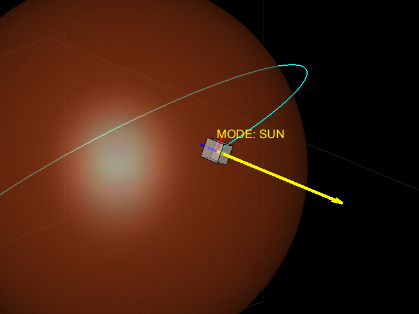

# Mars AOCS Simulation

Attitude control simulation for a spacecraft in Low Mars Orbit.

## Features
- MRP-based rigid body dynamics
- PD attitude control
- Sun / Nadir / Communication mode switching
- RK4 integration

## Animation

## Key Equation

ω̇ = I⁻¹ (u − ω × Iω)

u = -K σ_BR - P ω_BR
